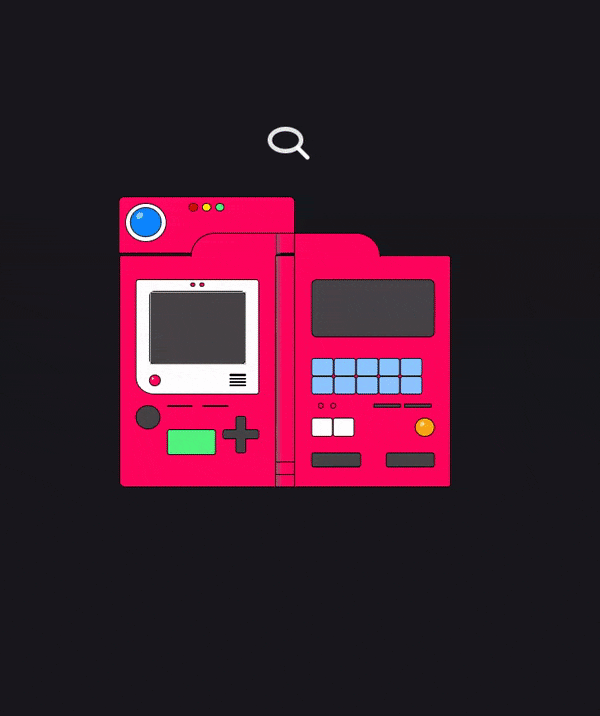

# PokeDex Search

> Exercise to refactor pure javascript app to incorporate both react frontend.
> Refactor also stores prior successful search and display them as cards.
> 
> Live demo [_here_](https://shouwangh.github.io/Search-PokeDex/). (Note: Browser extensions which use Local Storage may interfere with the demo)

## Table of Contents
* [General Info](#general-information)
* [Technologies Used](#technologies-used)
* [Acknowledgements](#acknowledgements)
* [Contact](#contact)

## General Information
> Pokedex frontend which accesses [pokeapi](https://pokeapi.co/) and loads the pokedex with applicable information. 
> Previous searches are saved in local storage and are also displayed in a card format. I wanted to store previous info but didn't necessarily 
> want to have database and thus familiarized myself with local storage to complete this project. Because of the particularities of local storage's
> allowable items being key value pairs, I also had the challenge of structuring data in json format and parsing back and forth between object and string
> in order to store or access the data.  
> There was also the challenge of clearing local storage and re-rendering which was handled with an onClick function which updated a react state. 
> That state was a dependencies in a useEffect function which served the dual purpose of re-rendering and clearing local storage.

## Technologies Used

## Acknowledgements
- Various CSS items were retooled including pokedex and pokemon cards as well as search carat function

## Contact
- Feel free to peruse other projects or contact me below.

